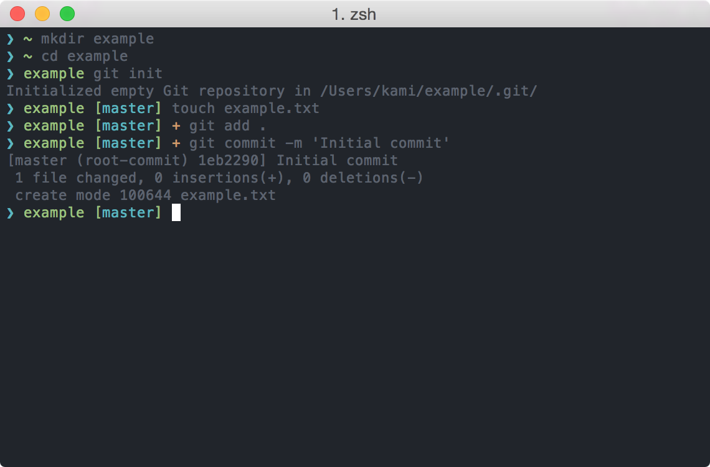

# prezto-prompt-simple

prezto-prompt-simple is a simple theme for [Prezto](https://github.com/sorin-ionescu/prezto).

## Screenshot



## Installation

Install:

```
$ curl https://raw.githubusercontent.com/kami30k/prezto-prompt-simple/master/prompt_simple_setup > ~/.zprezto/modules/prompt/functions/prompt_simple_setup
```

Enable:

```sh
# ~/.zpreztorc
zstyle ':prezto:module:prompt' theme 'simple'
```

## Contributing

Bug reports and pull requests are welcome on GitHub at https://github.com/kami30k/prezto-prompt-simple.
